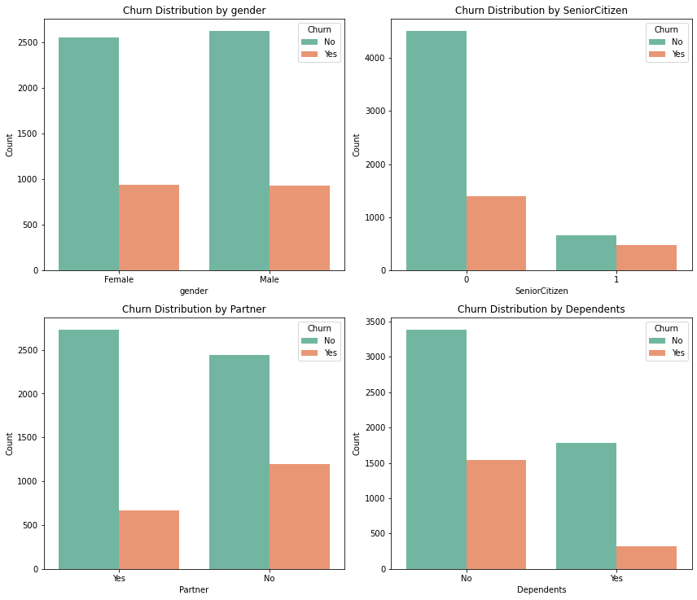
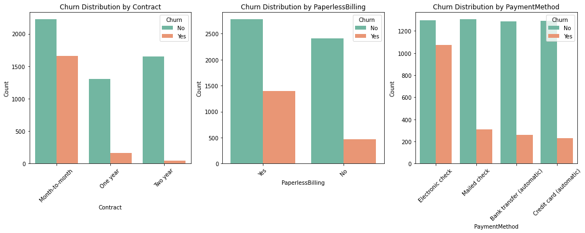
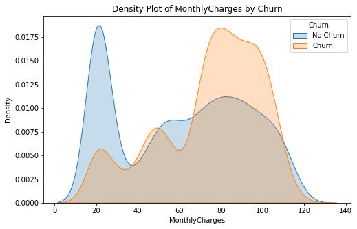
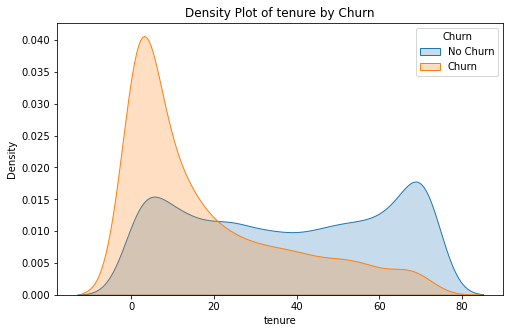

# Customer Churn Prediction Project

## Overview
This project aims to predict customer churn in a telecommunications dataset using machine learning models. The primary objective is to enable proactive retention strategies by accurately identifying customers who are likely to churn and uncovering key drivers influencing churn. The project includes data preprocessing, exploratory analysis, iterative modeling, and actionable recommendations for business decision-making.
## Business Understanding
In subscription-based businesses, retaining customers is essential for sustained profitability. When customers leave, it doesn’t just affect current revenue,it also drives up the cost of acquiring new ones. By identifying the reasons behind customer churn and accurately predicting it, businesses can:Concentrate efforts on high-risk customers and implement targeted retention strategies, Create personalized experiences that address the specific needs of at-risk customers,Reduce the financial impact of churn while building stronger, long-term relationships with their customers.

This project aims to achieve these objectives by using data-driven insights and predictive models to address churn effectively, ensuring both customer satisfaction and business growth.

### Objectives
1. To identify the most significant factors driving customer churn
2. To accurately predict customers likely to churn using a data-driven model.
3. To identify predictive models can best forecast customer churn.

## Data Understanding
### Data Sources
The dataset used for this project is from kaggle, a public repository and contains customer data from a telecom company.
### Data Overview
The dataset includes features such as customer tenure, monthly charges, payment methods, and churn status. Key details include:

- Target Variable: Churn (Yes/No).
- Numerical Features: Tenure, MonthlyCharges, TotalCharges, SeniorCitizen.
- Categorical Features: Contract Type, Internet Service, Payment Method, customerID,Partner , PhoneService, gender, MultipleLines, OnlineSecurity,techSupport, OnlineBackup,StreamingMovies,DeviceProtection,Dependents    

## Data Preparation
The following steps were undertaken during data preperation:
- Handled missing values
- converted TotalCharges column from object to integer
- Checked the distribution of numerical variables for consistent scaling.

## Exploratory Data Analysis (EDA)
The EDA aimed to uncover patterns, trends, and key drivers of customer churn. Below are the key findings, supported by visualizations:
1. Demographics and Churn
Insight: Certain demographic groups (e.g., age, gender, or location) show higher churn rates, providing targets for tailored interventions.

2.  Services and Churn
Insight: Churn is more common among customers subscribing to fewer additional services.

3. Account information and Churn
Contract: Long-term contract customers churn less, indicating stability.
PaperlessBilling: Higher churn rates among paperless billing users suggest dissatisfaction with digital systems.
PaymentMethod: electronic check users churn more as compared to other payment methods.

4. Monthly Charges and Churn
Insight: Customers with higher monthly charges are more likely to churn, indicating price sensitivity.

5. Tenure and Churn
Insight: Customers with lower tenure are more likely to churn, suggesting retention strategies should focus on onboarding and early engagement.

## Data Preprocessing
- Dropped unnecessary columns.
- split the data into train and test sets.
- onehotencoded the categorical variables and scaled the numerical variables

## Modeling
Built multiple models to predict churn, including Logistic Regression, Decision Tree, and Random Forest.
The Baseline Model is Logistic Regression with default parameters for interpretability.
Refined Models using cross validation Hyperparameter-tuned Logistic Regression and advanced models like Decision Tree and Random Forest.
Evaluated models using metrics such as accuracy, recall, precision, F1-score, and ROC-AUC.
did cross-validation to provide detailed insights into the performance of my classification model by showing how predictions are distributed among the true positive, true negative, false positive, and false negative categories. 

## Model Selection
Selected the best-performing model based on accuracy and ROC-AUC to ensure effective identification of churners.

## Limitations
1. Class Imbalance:
The dataset is imbalanced, with fewer churn cases than non-churn cases, which affects model performance.
Future Work: Apply advanced techniques like SMOTE or ensemble methods to better address class imbalance.
2. Limited Features:
The dataset lacks potential features like customer support interactions, feedback, or competitor pricing, which could improve model accuracy.
Future Work: Incorporate additional data sources for richer predictions.
3. Recall vs. Precision Trade-off:
While the model achieves high recall, precision is moderate, leading to some false positives. This may result in unnecessary retention efforts.
Future Work: Optimize the classification threshold to balance recall and precision based on business needs.

## Recommendations and Areas of Improvement
1. Utilize Model Predictions for Targeted Retention Campaigns:

- Retaining existing customers is more cost-effective than acquiring new ones. By focusing on customers flagged as likely churners, businesses can prioritize resources effectively.
- **Action:** Develop personalized retention strategies such as discounts, loyalty programs, or tailored communication for at-risk customers to prevent churn and maximize revenue.
2. Enhance Data Quality and Feature Enrichment:

- The quality and diversity of data directly influence model performance. Missing or irrelevant features may prevent the model from accurately identifying churn patterns.
- **Action:** Incorporate additional data sources such as customer support interactions, complaint records, and external market data to improve the model’s predictive capabilities and actionable insights.
3. Monitor Model Performance and Retrain Regularly:

- Customer behaviors and market dynamics evolve over time, which can lead to model drift. Regular monitoring ensures that predictions remain accurate and relevant.
- **Action:** Set up periodic model evaluations and retraining using updated data to adapt to changing patterns and maintain high performance.

## Conclusion
This project successfully predicts customer churn and provides actionable insights for retention strategies. While limitations such as class imbalance and limited feature diversity exist, addressing these areas can further improve the model's effectiveness in real-world applications. The results offer a strong foundation for reducing customer attrition and maximizing revenue.

## Resources
- Dataset: [Link ](WA_Fn-UseC_-Telco-Customer-Churn.csv)
- Notebook: [Link ](Customer_Churn.ipynb)
- Documentation: 